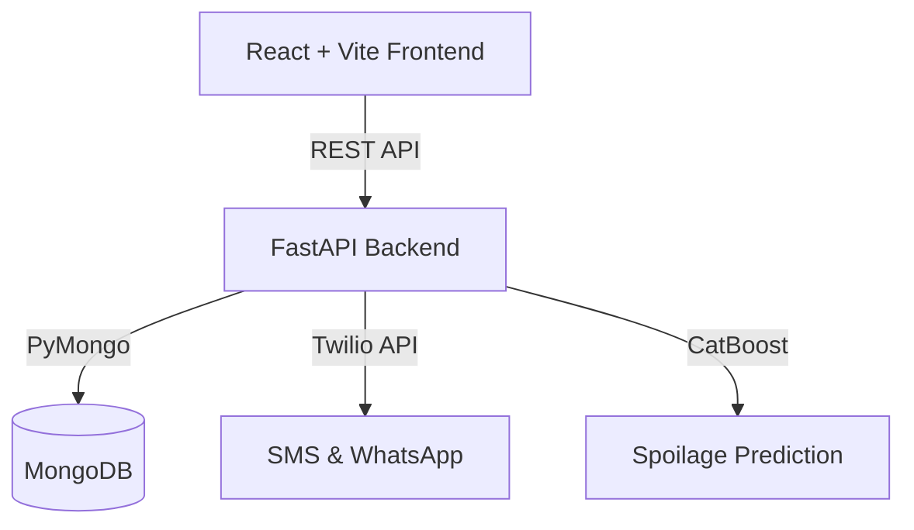

# Annam — Food Rescue Platform 🌾

[](https://vitejs.dev/)
[](https://reactjs.org/)
[](https://fastapi.tiangolo.com/)
[](https://www.mongodb.com/)

Annam is a comprehensive food rescue ecosystem designed to bridge the gap between food surplus and food scarcity. By connecting farmers, NGOs, drivers, and consumers, Annam enables intelligent, real-time logistics for preventing food spoilage and feeding those in need.

## Features by Role

### 🚜 Farmer Dashboard
- **Spoilage Prediction:** Machine learning models predict crop shelf life based on regional weather and produce type.
- **Dynamic Pricing:** Smart pricing algorithms automatically reduce prices as produce approaches expiry to maximize sales.
- **Rescue Listing:** One-click donation of unsellable surplus directly to NGOs.

### 🤝 NGO Dashboard
- **Priority Claims:** NGOs get early access to surplus food donations.
- **Impact Tracking:** Measurable analytics on meals rescued, people fed, and carbon emissions saved.
- **Real-Time Tracking:** Live GPS tracking of incoming food deliveries.

### 🚚 Driver (Logistics) Network
- **Smart Dispatch:** Ola/Uber-style dispatch system cascades requests to the nearest available drivers.
- **Earnings & Rewards:** Incentive-based platform for independent logistics partners to earn by rescuing food.
- **Optimized Routing:** Turn-by-turn navigation for efficient multi-stop pickups.

### 🛒 Customer Marketplace
- **Eco-Conscious Shopping:** Access discounted, near-expiry produce to combat food waste.
- **Secure Payments:** Integrated wallet and payment systems.
- **Order Tracking:** Full transparency on delivery status.

---

## 🏗 System Architecture



## 🚀 Getting Started

### Prerequisites
- Node.js (v18+)
- Python (v3.10+)
- MongoDB (v6.0+) running locally or via Atlas

### Environment Setup

#### Frontend (`/`)
No `.env` required for local development. Vite's proxy automatically routes `/api` requests to `http://localhost:8000`.

#### Backend (`/backend`)
Create a `.env` file in the `backend/` directory using the provided template:
```bash
cp backend/.env.example backend/.env
```

| Variable | Description |
|----------|-------------|
| `MONGODB_URI` | Connection string for your MongoDB instance |
| `DATABASE_NAME` | Name of the Mongo database (default: `annam`) |
| `JWT_SECRET` | Secret key for JWT signing |
| `TWILIO_*` | Credentials for SMS & WhatsApp notifications |

### Running the Application

**1. Start the Backend (FastAPI)**
```bash
cd backend
python -m venv .venv
source .venv/bin/activate  # Or .venv\Scripts\activate on Windows
pip install -r requirements.txt
python -m uvicorn app.main:app --reload
```

**2. Start the Frontend (Vite/React)**
```bash
npm install
npm run dev
```

The frontend will be available at `http://localhost:5173`.
The backend API docs will be available at `http://localhost:8000/docs`.

---

## 🔒 Security Note
**API Keys & Secrets:** Do not commit `.env` files. Ensure you have rotated any API keys or JWT secrets if you are deploying to production.

## 🤝 Contributing
Contributions are welcome! Please open an issue first to discuss what you would like to change before submitting a Pull Request.

1. Fork the Project
2. Create your Feature Branch (`git checkout -b feature/AmazingFeature`)
3. Commit your Changes (`git commit -m 'Add some AmazingFeature'`)
4. Push to the Branch (`git push origin feature/AmazingFeature`)
5. Open a Pull Request
