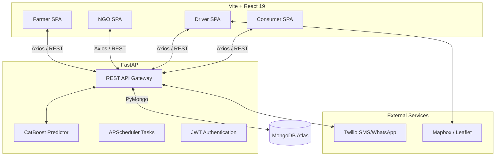

<div align="center">
  

  # Annam — Intelligent Food Rescue Ecosystem 🌾
  
  **Bridging the gap between agricultural surplus and zero hunger.**

  [](https://vitejs.dev/)
  [](https://react.dev/)
  [](https://fastapi.tiangolo.com/)
  [](https://www.mongodb.com/)
  [](https://catboost.ai/)
</div>

<br />

Annam is an end-to-end, real-time logistics and marketplace platform designed to eradicate food waste. By integrating machine learning with a four-sided marketplace (Farmers, NGOs, Logistics Drivers, and Everyday Consumers), Annam intelligently predicts food spoilage and orchestrates rapid distribution of surplus produce before it goes to waste.

---

## 🌟 Core Features & Modules

Annam operates through four interconnected, role-based dashboards powered by a centralized backend.

### 🚜 Farmer Ecosystem
- **ML Spoilage Prediction:** Utilizes a CatBoost machine learning model to predict the shelf-life of produce based on historical weather patterns, humidity, and crop type.
- **Dynamic Pricing Engine:** Automatically triggers price reductions as produce approaches its predicted expiry window to maximize liquidation.
- **One-Click Rescue:** Seamlessly transition unsold, near-expiry stock into NGO donations with zero friction.
- **Yield Analytics:** Comprehensive reporting via Recharts on sales velocity and waste reduction.

### 🤝 NGO Dashboard
- **Priority Claim System:** Dedicated NGO routing guarantees non-profits get first right of refusal on high-value donations.
- **Impact Tracking:** Quantifiable analytics dashboard tracking total meals rescued, individuals fed, and CO₂ emissions mitigated.
- **Automated Verification:** Twilio-powered OTP verification for secure handoffs between drivers and NGOs.

### 🚚 Driver Command Center
- **Algorithmic Dispatching:** Uber-style dispatch system that cascades pickup requests to the nearest available drivers using Leaflet-based geospatial indexing.
- **Optimized Multi-Stop Routing:** Turn-by-turn navigation mapping for efficient, multi-node pickup and delivery sequences.
- **Incentivized Logistics:** Earnings and rewards tracking for independent logistics partners participating in the rescue network.

### 🛒 Consumer Marketplace
- **Eco-Conscious Retail:** Direct-to-consumer access to heavily discounted, perfectly safe, near-expiry produce.
- **Real-Time Order Tracking:** Full transparency on delivery status and driver geolocation.

---

## 🏗 Technical Architecture

Annam follows a decoupled, service-oriented architecture with a heavy emphasis on real-time data flow and machine learning integrations.



### 💻 Tech Stack Deep Dive

**Frontend:**
- **Core:** React 19, Vite, TypeScript
- **Routing:** React Router DOM v7 (with lazy loading & Suspense boundaries)
- **State & Data:** Custom React hooks, LocalStorage synchronization
- **Mapping & Data Viz:** React Leaflet, Recharts, Framer Motion

**Backend:**
- **Framework:** FastAPI (Python 3.10+) with Uvicorn
- **Database:** MongoDB (via PyMongo)
- **Machine Learning:** CatBoost, Scikit-learn, Pandas, Joblib
- **Background Jobs:** APScheduler for expiry status polling
- **Authentication:** Passlib (Bcrypt) & JWT
- **Communications:** Twilio SDK

---

## 🚀 Getting Started

### Prerequisites
- Node.js (v18+)
- Python (v3.10+)
- MongoDB (v6.0+) running locally or via MongoDB Atlas

### 1. Backend Setup

Navigate to the `backend` directory and set up the Python environment:

```bash
cd backend
python -m venv .venv
source .venv/bin/activate  # Windows: .venv\Scripts\activate
pip install -r requirements.txt
```

**Environment Variables:**
Create a `.env` file in the `backend` directory. Do **not** commit this file.

```bash
cp .env.example .env
```
Ensure you populate `MONGODB_URI`, `JWT_SECRET`, and your `TWILIO_*` credentials.

**Start the API Server:**
```bash
python -m uvicorn main:app --reload --port 8000
```
*API Documentation will be available at `http://localhost:8000/docs`.*

### 2. Frontend Setup

Navigate to the root directory and install Node dependencies:

```bash
npm install
```

**Start the Development Server:**
```bash
npm run dev
```
*The application will be available at `http://localhost:5173`. Vite's proxy will automatically route `/api` requests to your local FastAPI backend.*

---

## 📂 Project Structure

```text
AnnamRepo/
├── backend/                  # FastAPI Application
│   ├── app/                  # Core API routes, models, and services
│   ├── ml/                   # CatBoost models and training scripts
│   ├── tests/                # Pytest integration & unit tests
│   ├── requirements.txt      # Python dependencies
│   └── main.py               # Uvicorn entrypoint
├── src/                      # React Frontend
│   ├── app/                  # Layouts, routing, and core App shell
│   ├── components/           # Reusable UI components & Error Boundaries
│   ├── hooks/                # Custom React hooks (useUser, useInView)
│   ├── modules/              # Role-based feature modules
│   │   ├── admin/
│   │   ├── auth/
│   │   ├── customer/
│   │   ├── driver/
│   │   ├── farmer/
│   │   └── ngo/
│   ├── types/                # TypeScript interface definitions
│   └── index.css             # Global design tokens and accessibility styles
├── docs/                     # Technical documentation & expiry algorithms
├── public/                   # Static assets
└── package.json              # Node dependencies & Vite config
```

---

## 🔒 Security & Best Practices

- **API Keys:** Never commit your `.env` file. If a key is accidentally committed, rotate it immediately in the respective provider's dashboard.
- **Code Splitting:** The frontend heavily utilizes `React.lazy()` to ensure role-based code splitting, reducing initial load times for users on cellular networks.
- **Error Handling:** Global `ErrorBoundary` components catch React rendering errors gracefully, while FastAPI provides structured HTTP exception responses.

## 🤝 Contributing

We welcome contributions to help expand the Annam ecosystem! 

1. Fork the Project
2. Create your Feature Branch (`git checkout -b feature/AmazingFeature`)
3. Commit your Changes (`git commit -m 'Add some AmazingFeature'`)
4. Push to the Branch (`git push origin feature/AmazingFeature`)
5. Open a Pull Request

---
<p align="center">
  <i>Building a sustainable future, one harvest at a time.</i>
</p>
